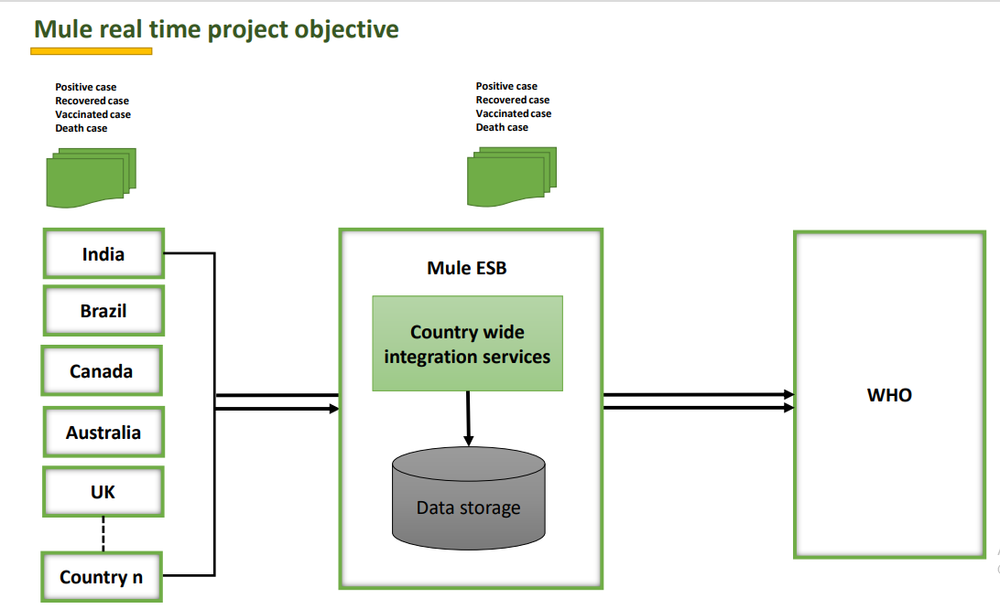
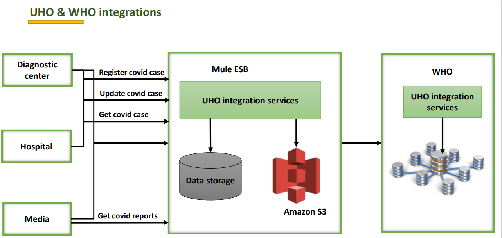
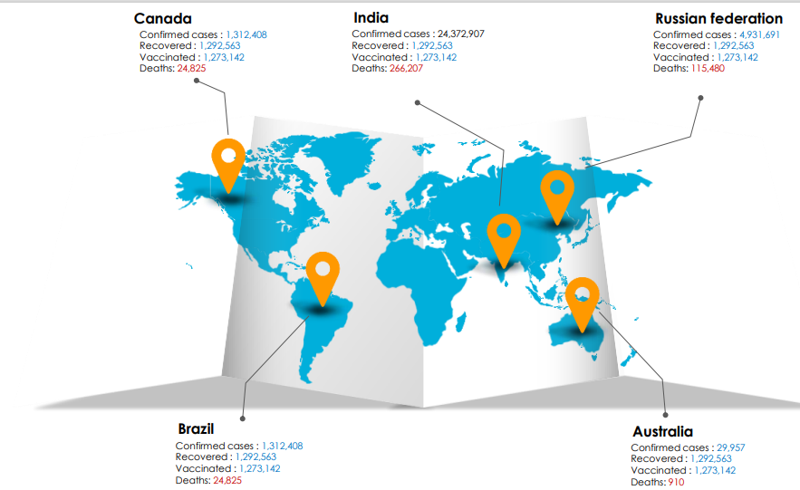

# Covid Case Dashboard (Countrywise) - API Led POC
Description

## Project Objective

## uhub & who integration High Level Design

## Covid Dashboard

## Covid Integration Architecture

|API's                          |Path                         |Description                 
|-------------------------------|-----------------------------|-----------------------------|
|tdd-mss-uhub-sapi              |[Download mss-uhub-sapi.raml](/mss-uhub-sapi.raml) |raml code for mss-uhub-sapi           |
|mss-uhub-sapi.raml             |[Download mss-uhub-sapi.raml](/mss-uhub-sapi.raml) |raml code for mss-uhub-sapi           |
|mss-uhub-sapi                  |[Download mss-uhub-sapi](/mss-uhub-sapi)|application of mss-uhub-sapi           |
|mss-who-sapi.raml              |[Download mss-who-sapi.raml](/mss-who-sapi.raml)|raml code for mss-who-sapi            |
|mss-who-sapi                   |[Download mss-who-sapi](/mss-who-sapi)|application of mss-who-sapi            |
|mss-aws-sapi.raml              |[Download mss-aws-sapi.raml](/mss-aws-sapi.raml)|raml code for mss-aws-sapi               |
|mss-aws-sapi                   |[Download mss-aws-sapi](/mss-aws-sapi)|application of mss-aws-sapi             |
|mss-covid-papi.raml            |[Download mss-covid-papi.raml](/mss-covid-papi.raml)|raml code for mss-covid-papi               |
|mss-covid-papi                 |[Download mss-covid-papi](/mss-covid-papi)|application of mss-covid-papi              |
|mss-covid-eapi.raml            |[Download mss-covid-eapi.raml](/mss-covid-eapi.raml)|raml code for mss-covid-eapi              |
|mss-covid-eapi                 |[Download mss-covid-eapi](/mss-covid-eapi)|application of mss-covid-eapi              |
